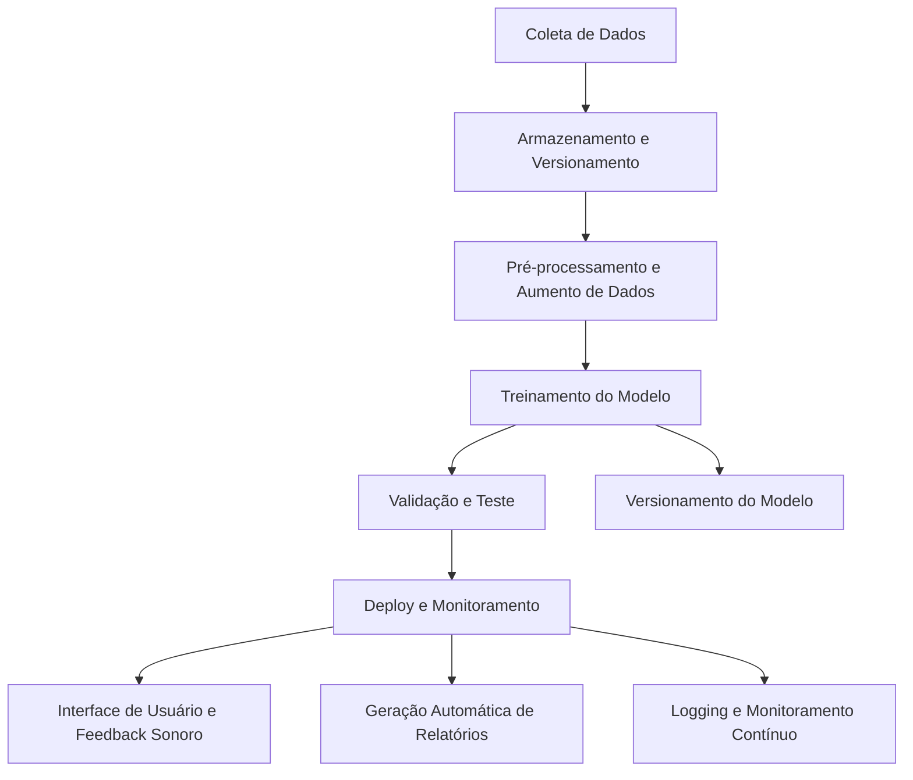

# Detecção de Utensílios de Cozinha com IA  

## 📌 Introdução  

A cozinha é um ambiente repleto de utensílios que facilitam o preparo das refeições. No entanto, encontrar o utensílio certo pode ser um desafio, especialmente para quem tem pouco espaço de armazenamento ou para pessoas com deficiência visual.  

A Inteligência Artificial (IA) pode ser uma aliada nessa tarefa, permitindo a detecção automática de utensílios de cozinha através de imagens. Este projeto utiliza o **Teachable Machine**, uma ferramenta do Google, para criar um modelo de IA capaz de **identificar e classificar utensílios de cozinha** de forma interativa e acessível, sem necessidade de conhecimento técnico avançado.  

## Índice

- [Visão Geral](#visão-geral)
- [Arquitetura do Projeto](#arquitetura-do-projeto)
- [Estrutura de Pastas](#estrutura-de-pastas)
- [Requisitos](#requisitos)
- [Instalação](#instalação)
- [Uso](#uso)
  - [Pré-processamento e Treinamento](#pré-processamento-e-treinamento)
  - [Avaliação e Testes](#avaliação-e-testes)
  - [Deploy e Inferência](#deploy-e-inferência)
  - [Feedback Sonoro](#feedback-sonoro)
  - [Geração de Relatório PDF](#geração-de-relatório-pdf)
- [Detecção e Classificação de Utensílios de Cozinha com IA](#Detecção-e-Classificação-de-Utensílios-de-Cozinha-com-IA)
- [Licença](#licença)
- [Contato](#contato)

---

## 🎯 Objetivos  

✔️ Criar um modelo de IA para detectar e classificar diferentes utensílios de cozinha com base em fotografias.  
✔️ Explorar conceitos básicos de aprendizado de máquina e visão computacional.  
✔️ Aprender a usar o **Teachable Machine** para desenvolver modelos interativos.  
✔️ Avaliar o desempenho do modelo na detecção e classificação dos utensílios.  

---  

## Visão Geral

O projeto visa facilitar o preparo de refeições, permitindo que usuários encontrem rapidamente o utensílio desejado mesmo em ambientes com pouco espaço ou para pessoas com deficiência visual. Para isso, o sistema utiliza uma arquitetura modular que contempla:

- **Coleta e Versionamento dos Dados:** Organização das imagens em categorias e uso de ferramentas como DVC para rastreamento.
- **Pré-processamento e Aumento de Dados:** Normalização e técnicas de data augmentation para robustecer o modelo.
- **Treinamento e Avaliação:** Modelo de rede neural convolucional (CNN) treinado com TensorFlow/Keras, com métricas detalhadas (acurácia, matriz de confusão e relatório de classificação).
- **Deploy e Monitoramento:** Possibilidade de expor o modelo via API e monitorar sua performance.
- **Acessibilidade:** Feedback sonoro utilizando gTTS para auxiliar pessoas com deficiência visual.
- **Geração de Relatório Automático:** Criação de um relatório PDF contendo metodologia, resultados e análise crítica.

---

## Arquitetura do Projeto

A arquitetura é dividida em módulos que facilitam a manutenção e a escalabilidade do sistema:

---

## 🚀 Etapas do Projeto  

### 1️⃣ Coleta de Dados  

📸 **Captura de imagens** de diversos utensílios de cozinha, divididos em categorias (exemplo: talheres, panelas, utensílios de preparo).  
🔍 **Garantia da qualidade das imagens** (boa iluminação, foco nítido, sem elementos extras que possam confundir o modelo).  
📂 **Separação dos dados** em conjunto de treinamento e conjunto de teste.  

### 2️⃣ Treinamento do Modelo  

🔗 Acessar o **Teachable Machine** ([link](https://teachablemachine.withgoogle.com)) e selecionar **"Classificação de Imagem" → "Imagem Padrão"**.  
📤 Carregar as **imagens de treinamento**, organizando-as por categoria.  
⚙️ Ajustar parâmetros como **número de classes e tamanho da imagem**.  
📊 Treinar o modelo e **monitorar o desempenho** com métricas de **precisão e acurácia**.  
🛠️ Testar **configurações avançadas** como **épocas, batch size e learning rate**.  

### 3️⃣ Teste e Avaliação do Modelo  

✅ Testar o modelo com **imagens inéditas**.  
📈 Analisar **acertos e erros** na classificação.  
🔎 Observar **precisão e acurácia** nos testes.  
📢 Identificar **possíveis melhorias** no modelo.  

### 4️⃣ Apresentação dos Resultados  

📌 Criar um **relatório detalhado em PDF** contendo:  
- Metodologia utilizada.  
- Prints das etapas principais.  
- Explicação do processo.  
- Justificativa técnica dos resultados.  
- Análise crítica e sugestões de melhoria.  

---  

## 🛠️ Tecnologias Utilizadas  

- **Teachable Machine** (Google)  
- **Visão Computacional**  
- **Aprendizado de Máquina** 